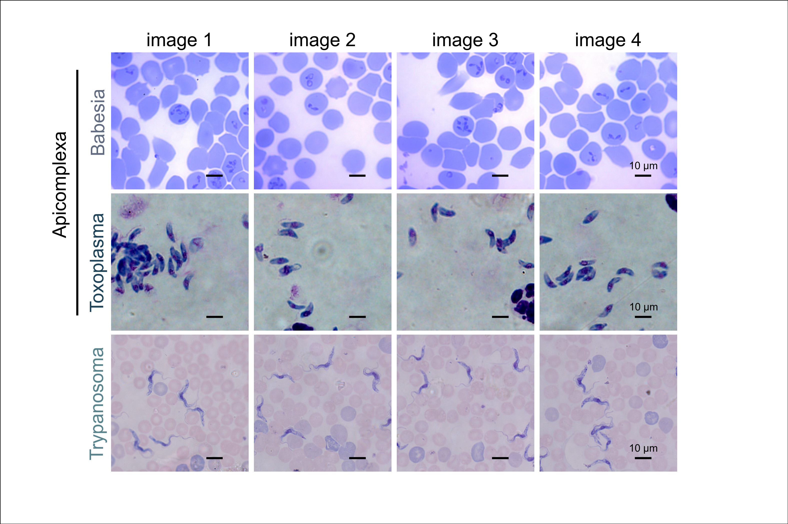

# Panel Plot
Script to generate a panel plot of images with specified dimensions. The function creates a grid of subplots, each displaying an image from the provided list of image paths. The plot uses Babesia, Toxoplasma and Trypanosoma microscopic images for demonstration and includes example annotations. 

The dataset used for demonstration and associated publications are listed below:

- [Li, S., & Zhang, Y. (2020). Microscopic images of parasites species. Mendeley Data, 3, 290-309.](https://data.mendeley.com/datasets/38jtn4nzs6/3)
- [Zhang, C., Jiang, H., Liu, W., Li, J., Tang, S., Juhas, M., & Zhang, Y. (2022). Correction of out-of-focus microscopic images by deep learning.](https://doi.org/10.1016/j.csbj.2022.04.003)
- [Jiang, H., Li, S., Liu, W., Zheng, H., Liu, J., & Zhang, Y. (2020). Geometry-aware cell detection with deep learning. Msystems, 5(1), 10-1128.](https://doi.org/10.1128/msystems.00840-19)
- [Li, S., Yang, Q., Jiang, H., Cortés-Vecino, J. A., & Zhang, Y. (2020). Parasitologist-level classification of apicomplexan parasites and host cell with deep cycle transfer learning (DCTL). Bioinformatics, 36(16), 4498-4505.](https://doi.org/10.1093/bioinformatics/btaa513)

installation:

```bash
pip install -r requirements.txt
```

usage:

```bash
python panel_plot.py
```

Cite As

[Nzakimuena, C. B., Solano, M. M., Marcotte-Collard, R., Lesk, M. R., & Costantino, S. (2025). Spatial and temporal changes in choroid morphology associated with long-duration spaceflight. Investigative Ophthalmology & Visual Science, 66(5), 17-17.](https://doi.org/10.1167/iovs.66.5.17)

